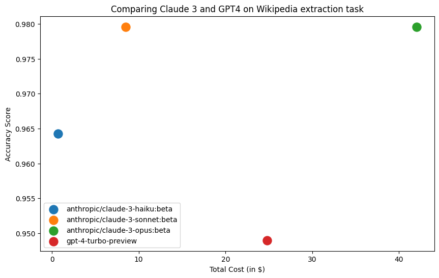

# Comparing GPT-4 and Claude 3 on long-context tasks

_Why you should take benchmarks with a grain of salt_

By [Aman Dhesi](https://twitter.com/amansplaining)

Anthropic released the Claude 3 family of models last month, [claiming it beats GPT-4 on all benchmarks](https://twitter.com/AnthropicAI/status/1764653830468428150). But others [disagreed with these claims](https://twitter.com/TolgaBilge_/status/1764754012824314102).

So which one is it - is Claude 3 better than GPT-4 or not? And isn't the whole point of benchmarks to evaluate the models objectively and remove the guesswork?

The answer is... it depends. Which model is better depends on what task you use the model for, and what data you use it on.

Instead of relying on third-party benchmarks, [as Hamel Husain suggests](https://www.linkedin.com/feed/update/urn:li:activity:7179532266283446272/) you should be evaluating models on your own, domain-specific data, with all its nuances and intricacies.

In this short blogpost, we'll evaluate Claude 3 and GPT-4 on a specific long-context extraction task. We'll do this comparison using Superpipe which makes it easy to swap in different models and compare them on accuracy, cost and speed.

All the code and data is available [in this Colab notebook](https://colab.research.google.com/drive/1JQpkQjHnFJ-8MkcyMLwdUq5Ve7OsmauO).

## The task - long context extraction

For some types of tasks, we need LLMs with very long context windows. Currently the only LLMs with context windows longer than 100K are GPT-4 and the Claude 3 family of models.

Conventional wisdom suggests that the bigger and more expensive a model is, the more accurate it is on all tasks. Let's evaluate whether this is true on a specific task - extracting information from Wikipedia pages of famous people.

Given the wikipedia page of a (real) person, we'll use an LLM to extract their date of birth, whether or not they're still alive and if not, their cause of death.

We'll perform a single LLM call and pass in the entire contents of the Wikipedia page. Wikipedia pages of famous people can easily be more than 50k tokens in length, which is why only models with context windows longer than 100k are eligible for this task.

## The data

Our dataset contains 49 data points, each containing 4 fields:

- a wikipedia url
- the person's true date of birth
- whether they're still alive
- if not alive, cause of death

The latter 3 fields are the labels, they're only used to evaluate the result of the LLM extraction. All the data can be found along with the code [here](https://colab.research.google.com/drive/1JQpkQjHnFJ-8MkcyMLwdUq5Ve7OsmauO).

## Results

The results are in:

- **The entire Claude 3 family outperforms GPT-4 on accuracy**
- **Haiku and Sonnet are both significantly cheaper than GPT-4 (34x and 3x, respectively)**
- There's no accuracy benefit in using Opus over Sonnet.

Based on these results, I would deploy Sonnet if I mainly cared about accuracy and Haiku if I was cost-sensitive.

## Using superpipe to compare models

Superpipe takes care of all the boilerplate when comparing models on tasks, including

- **Defining an eval function**, including using LLMs to perform evaluation
- Keeping track of **token usage and latency**
- **Error handling** to make sure a single error doesn't tank your whole experiment

To learn more about how to use Superpipe, check out [the docs](https://superpipe.ai)
