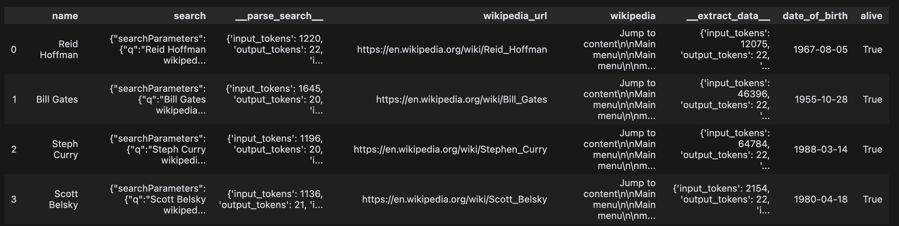
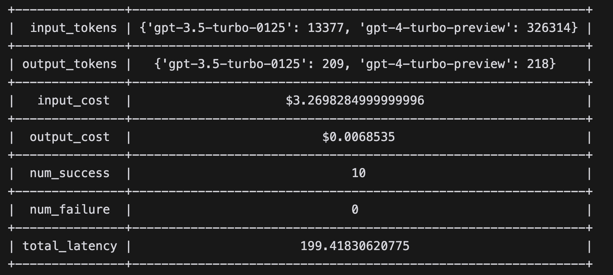

# Getting Started

## Installation

Make sure you have Python 3.10+ installed, then run

```
pip install superpipe-py
```

## Basic Usage (Build)

Let's start with Build. We'll build a pipeline that receives a list of names of famous people and figures out their birthdays and whether they're still alive. You can also download this as a [notebook](https://github.com/villagecomputing/superpipe/tree/main/docs/examples/web_scraping/web_scraping.ipynb) on Github.

First we define the input data. Although not a requirement, Superpipe works best with pandas dataframes.

```python
import pandas as pd

names = [
  "Reid Hoffman",
  "Bill Gates",
  "Steph Curry",
  "Scott Belsky",
  "Paris Hilton",
  "Snoop Dogg",
  "Ryan Reynolds",
  "Kevin Durant",
  "Mustafa Suleyman",
  "Aaron Swartz" # RIP
]

names_df = pd.DataFrame([{"name": name} for name in names])
```

This pipeline will work in 4 steps -

1. Do a google search with the person's name
2. Use an LLM to fetch the URL of their wikipedia page from the search results
3. Fetch the contents of the wikipedia page and convert them to markdown
4. Use an LLM to extract the birthdate and living or dead from the wikipedia contents

This is purely for illustration, and definitely not the most efficient way to accomplish this task.

```python
from superpipe.steps import LLMStructuredStep, CustomStep, SERPEnrichmentStep
from superpipe import models
from pydantic import BaseModel, Field
import requests

# Step 1: use Superpipe's built-in SERP enrichment step to search for the persons wikipedia page
# Include a unique "name" for the step that will used to reference this step's output in future steps

search_step = SERPEnrichmentStep(
  prompt= lambda row: f"{row['name']} wikipedia",
  name="search"
)

# Step 2: Use an LLM to extract the wikipedia URL from the search results
# First, define a Pydantic model that specifies the structured output we want from the LLM

class ParseSearchResult(BaseModel):
  wikipedia_url: str = Field(description="The URL of the Wikipedia page for the person")

# Then we use the built-in LLMStructuredStep and specify a model and a prompt
# The prompt is a function that has access to all the fields in the input as well as the outputs of previous steps

parse_search_step = LLMStructuredStep(
  model=models.gpt35,
  prompt= lambda row: f"Extract the Wikipedia URL for {row['name']} from the following search results: \n\n {row['search']}",
  out_schema=ParseSearchResult,
  name="parse_search"
)
```

Next, we'll create the final 2 steps of the pipeline and then the pipeline itself.

```python
from superpipe.pipeline import Pipeline
import html2text
h = html2text.HTML2Text()
h.ignore_links = True

# Step 3: we create a CustomStep that can execute any arbitrary function (transform)
# The function fetches the contents of the wikipedia url and converts them to markdown

fetch_wikipedia_step = CustomStep(
  transform=lambda row: h.handle(requests.get(row['wikipedia_url']).text),
  name="wikipedia"
)

# Step 4: we extract the date of birth and alive or dead status from the wikipedia contents

class ExtractedData(BaseModel):
    date_of_birth: str = Field(description="The date of birth of the person in the format YYYY-MM-DD")
    alive: bool = Field(description="Whether the person is still alive, make sure to return true or false")

extract_step = LLMStructuredStep(
  model=models.gpt4,
  prompt= lambda row: f"Extract the date of birth for {row['name']} and whether they're still alive from the following Wikipedia content: \n\n {row['wikipedia']}",
  out_schema=ExtractedData,
  name="extract_data"
)

# Finally we define and run the pipeline

pipeline = Pipeline([
  search_step,
  parse_search_step,
  fetch_wikipedia_step,
  extract_step
])

pipeline.run(names_df)
```

**Outputs**

When the pipeline is run, it will write all the intermediate outputs and the final outputs into `names_df` and print the dataframe.

<p align="center"></p>

**Pipeline Statistics**

You can view the statistics (cost, token usage and latency) of the run with

```python
print(pipeline.statistics)
```

<p align="center"></p>

## Next Steps

[**Evaluate**](../evaluate) &mdash; to learn about evaluating your pipelines.

[**Concepts**](../concepts) &mdash; to understand the core concepts behind Superpipe.

[**Examples**](../examples) &mdash; for more advanced examples and usage.
