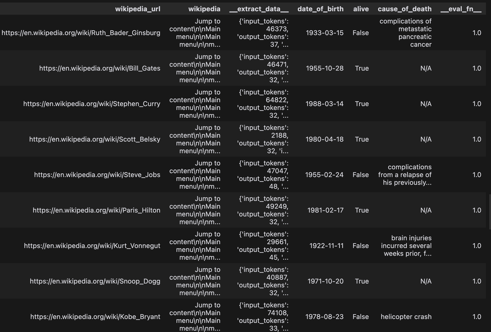

# Step 2: Evaluate

_In [Step 1](./build.md) we built a pipeline that receives a famous person's name and figures out their birthday, whether they're still alive, and if not, their cause of death. Now, we'll evaluate it on a dataset. Think of this as unit tests for your code. You wouldn't ship code to production without testing it, you shouldn't ship LLM pipelines to production without evaluating them._

<hr>

To do this, we need:

- **A dataset with labels** - In this case we need a list of famous people and the true date of birth, living status and cause of death of each person. We will assume we already have these, although in the real world we'd use our pipeline to create candidate labels and manually correct them where wrong.

- **Evaluation function** - a function that defines what "correct" is. We'll use simple comparison for date of birth and living status, and an LLM call to evaluate the correctness of cause of death.

[View notebook on Github](https://github.com/villagecomputing/superpipe/tree/main/docs/examples/web_scraping/web_scraping.ipynb)

```python
import pandas as pd

data = [
  ("Ruth Bader Ginsburg", "1933-03-15", False, "Pancreatic cancer"),
  ("Bill Gates", "1955-10-28", True, "N/A"),
  ("Steph Curry", "1988-03-14", True, "N/A"),
  ("Scott Belsky", "1980-04-18", True, "N/A"),
  ("Steve Jobs", "1955-02-24", False, "Pancreatic tumor/cancer"),
  ("Paris Hilton", "1981-02-17", True, "N/A"),
  ("Kurt Vonnegut", "1922-11-11", False, "Brain injuries"),
  ("Snoop Dogg", "1971-10-20", True, "N/A"),
  ("Kobe Bryant", "1978-08-23", False, "Helicopter crash"),
  ("Aaron Swartz", "1986-11-08", False, "Suicide")
]
df = pd.DataFrame([{"name": d[0], "dob_label": d[1], "alive_label": d[2], "cause_label": d[3]} for d in data])

class EvalResult(BaseModel):
  result: bool = Field(description="Is the answer correct or not?")

cause_evaluator = LLMStructuredStep(
  model=models.gpt4,
  prompt=lambda row: f"This is the correct cause of death: {row['cause_label']}. Is this provided cause of death accurate? The phrasing might be slightly different. Use your judgement: \n{row['cause_of_death']}",
  out_schema=EvalResult,
  name="cause_evaluator")

def eval_fn(row):
  score = 0
  if row['date_of_birth'] == row['dob_label']:
    score += 0.25
  if row['alive'] == row['alive_label']:
    score += 0.25
  if row['cause_label'] == "N/A":
    if row['cause_of_death'] == "N/A":
      score += 0.5
  elif cause_evaluator.run(row)['result']:
    score += 0.5
  return score

pipeline.run(df)
print("Score: ", pipeline.evaluate(eval_fn))
df
```

## Output

```
Score: 1.0
```

<p align="center"></p>

Our pipeline gets an accuracy score of 100% on this dataset! This is great news. But before we deploy this in production, we'll look at the cost and speed of the pipeline and try to [optimize](./optimize.md) it.

#### A note on ground truth labels

So far we've assumed we somehow had ground truth labels already. Usually this is not the case. Since our pipeline had 100% accuracy, we could've used it to generate ground truth labels if we didn't already have them. We'd of course have to manually inspect and fix any incorrect ones, which is a slow and tedious process. We're building [Superpipe Studio](./studio.md) to make this process easier.

## Next Steps

[**Optimize**](./optimize.md) &mdash; to learn about optimizing your pipelines for accuracy, cost & speed.

[**Concepts**](./concepts.md) &mdash; to understand the core concepts behind Superpipe.

[**Examples**](./examples.md) &mdash; for more advanced examples and usage.
